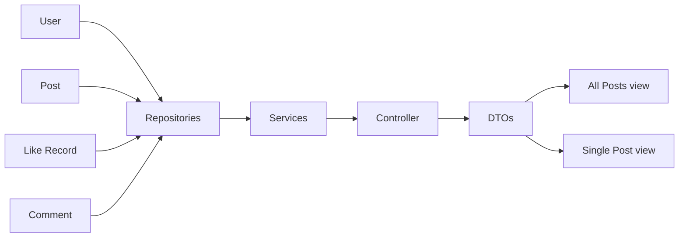

# Forum Application Documentation

## Table of Contents

- [Introduction](#introduction)
- [Common Issues](#common-issues)
- [Recent Improvements](#recent-improvements)
- [Future Guidelines](#future-guidelines)
- [Conclusion](#conclusion)

## Introduction

The Forum Application is a platform designed for users to discuss various topics, share posts, and engage with the community. It employs technologies like Spring Boot, Thymeleaf, Java, and a database to deliver its services. This document highlights recent improvements and common issues that have been addressed in the application.

## Common Issues

### 2.1. Navigation Simplification

**Issue:** Previously, the application lacked a clear navigation structure, making it challenging for users to move around.

**Solution:** A navigation bar has been introduced at the top of the application. It provides easy access to essential sections such as Home, User Profiles, Notifications, Filters, and Logout.

### 2.2. Post Access Improvement

**Issue:** Users had to click through multiple pages to read all posts, which was time-consuming and inconvenient.

**Solution:** Now, all posts are presented on a single page, with a simple navigation system at the top. Users can efficiently scroll through posts without switching pages.

## Recent Improvements

### 3.1. Streamlined Navigation

**Improvement:** The navigation bar simplifies user interaction by offering direct access to key sections:

- **Home:** Takes users to the main forum page.
- **User Profiles:** Allows users to view and customize their profiles.
- **Notifications:** Displays user notifications, such as likes, comments, and mentions.
- **Log Out:** Allows users to log out easily.

### 3.2. Improved Post Viewing

**Improvement:** All posts are now displayed on one page for a smoother user experience. The addition of pagination ensures that the page remains manageable even with a large number of posts.

## Future Guidelines
- **Addition of features:** Add new features that can make the forum more accessible like tagging of users, hiding the posts,and  adding admin to the forum for ease of management.
- **User Profiles:** Allows users to achieve reputation via the badges and encourage them to use forum application.

# Forum Flow Chart

## Conclusion

The Forum Application has addressed common usability issues and introduced new features to enhance the user experience. With the navigation bar and improved post viewing, users can now interact with the forum more efficiently. We remain committed to refining the application based on user feedback and continuously improving its features and functionality.

We appreciate your use of the Forum Application. If you have any questions or feedback, please feel free to reach out to our team.

Thank you for your continued support!

Team Members: Ameena, Ankan
